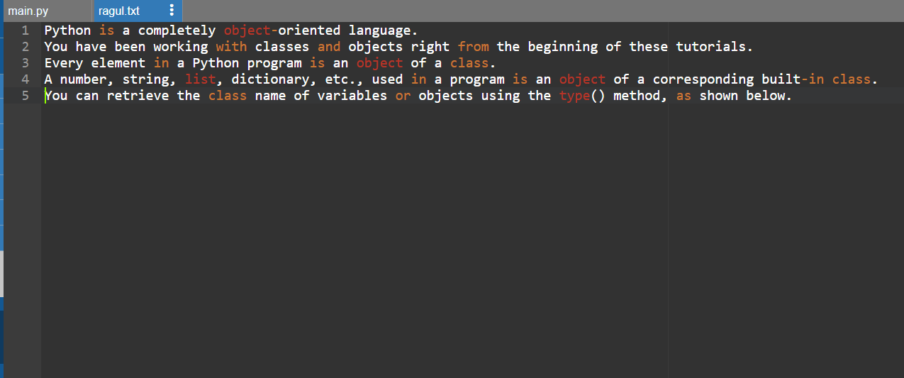
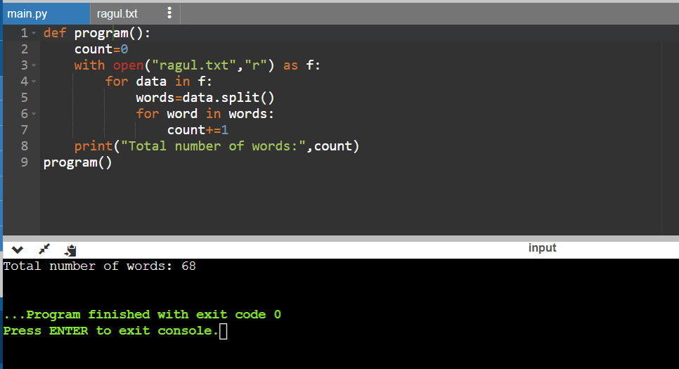

# Word-count
## AIM:
To write a python program for getting the word count from a text.
## EQUIPEMENT'S REQUIRED: 
PC
Anaconda - Python 3.7
## ALGORITHM: 
### Step 1:
create a file with .txt file extension
### Step 2: 
 add some text in that file
### Step 3: 
create a python file
### Step 4:  
write the code to count the number of words in that file
### Step 5: 
run the program
### Step 6: 
display the output
## PROGRAM:
~~~
def program():
    count=0
    with open("ragul.txt","r") as f:
        for data in f:
            words=data.split()
            for word in words:
                count+=1
    print("Total number of words:",count)
program()

~~~

### OUTPUT:

## RESULT:
Thus the program is written to find the word count from a text.
